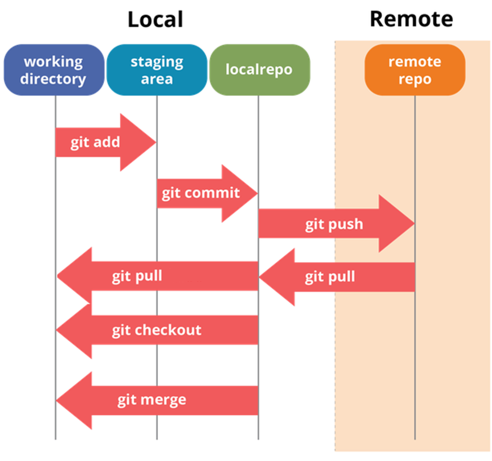
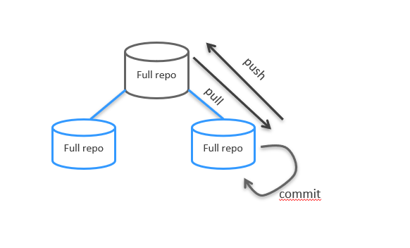
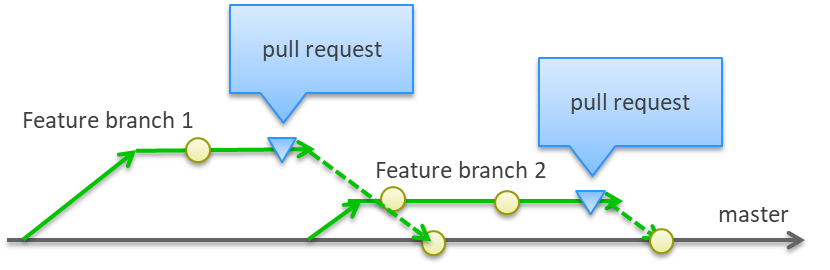
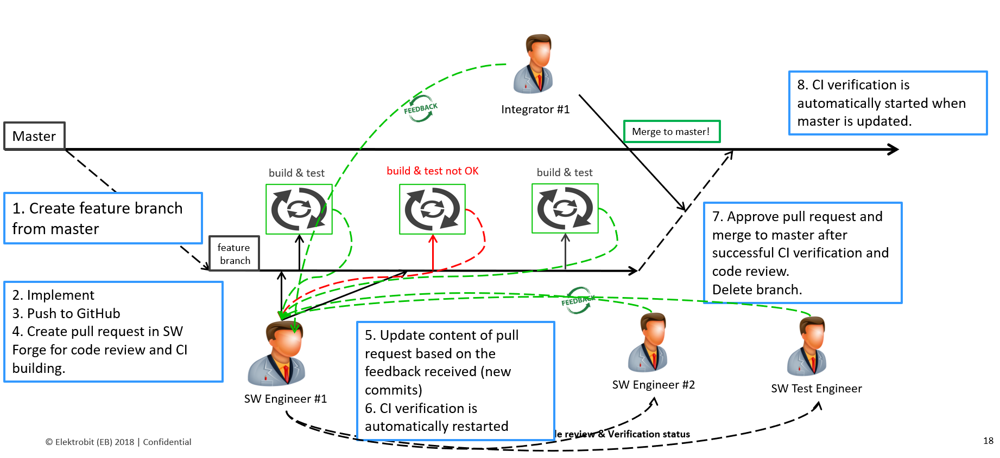

# Knowledge_sharing
Knowledge sharing about Git&amp;Github, DevContainer and GHCopilot

## Git & Github
### Git&Github ssh connection ([here you can more about ssh](https://docs.github.com/en/authentication/connecting-to-github-with-ssh/generating-a-new-ssh-key-and-adding-it-to-the-ssh-agent))
* generate a ssh key pair
  * follow the steps in the [link](https://docs.github.com/en/authentication/connecting-to-github-with-ssh/generating-a-new-ssh-key-and-adding-it-to-the-ssh-agent)
* add the ssh public key to your github account
  * follow the steps in the [link](https://docs.github.com/en/authentication/connecting-to-github-with-ssh/adding-a-new-ssh-key-to-your-github-account)

### Git configuration
* set your name
  * `git config --global user.name "your-name"`
* set your email
  * `git config --global user.email "your-email"`
* set your default editor
  * `git config --global core.editor "your-editor"`
* list all configurations
  * `git config --list`

### Git basic commands

* clone a repository
  * `git clone <repository-url>`
* add changes to the staging area
  * `git add <file-name>`
* commit changes
  * `git commit -m "commit message"`
* push changes to the remote repository
  * `git push`
* pull changes from the remote repository
  * `git pull`
* create a new branch
  * `git checkout -b <branch-name>`
* switch to a branch
  * `git checkout <branch-name>`
* merge a branch
  * `git merge <branch-name>`
* delete a branch
  * `git branch -d <branch-name>`
* list all branches
  * `git branch`
* list all branches including remote branches
  * `git branch -a`
* list all branches including remote branches with more information
  * `git branch -av`

### Git&Github distributed workflow

* Git and Github create a distributed workflow that allows multiple developers to work on the same project at the same time.
* The distributed workflow consists of a remote repository and a local repository.
* The remote repository is hosted on Github and the local repository is on your machine.
* The remote repository is a shared repository that all developers can access and contribute to.
* The local repository is a private repository that you can work on and make changes to.
* The distributed workflow allows you to push changes from your local repository to the remote repository and pull changes from the remote repository to your local repository.

### Git&Github branching strategy ([here you can read more about branching](https://www.atlassian.com/git/tutorials/comparing-workflows/feature-branch-workflow))
* feature branch workflow
  * create a new branch for each feature or bug fix
  * work on the branch until the feature or bug fix is complete
  * merge the branch back into the main branch
  * delete the branch

