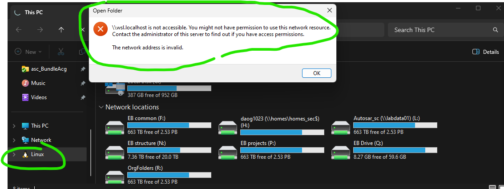
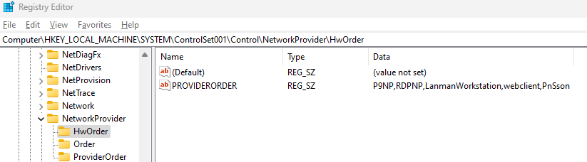

# Develoment under linux using containers
## WSL (Windows Subsystem for Linux)
On Windows 10, you can use WSL to run a Linux distribution alongside Windows. This allows you to run Linux commands and tools on Windows.
* how to install WSL : https://learn.microsoft.com/en-us/windows/wsl/install#install-wsl-command
  * if you want to access the WSL(linux) file system from file explorer and have this error:
    
    follow this steps:
    * solution is to update some registers. On win search type Regedit and click OK
    * have `P9NP` first for both HwOrder and Order
    * HKEY_LOCAL_MACHINE\SYSTEM\CurrentControlSet\Control\NetworkProvider\HwOrder `ProviderOrder    REG_SZ    P9NP,RDPNP,LanmanWorkstation,webclient`
    * HKEY_LOCAL_MACHINE\SYSTEM\CurrentControlSet\Control\NetworkProvider\Order `ProviderOrder    REG_SZ    P9NP,RDPNP,LanmanWorkstation,webclient`
    * shall look like here: 

## Docker
Docker is a platform for developing, shipping, and running applications in containers.
* how to install Docker in Windows : https://docs.docker.com/desktop/setup/install/windows-install/
* how to install Docker in Linux/WSL : https://docs.docker.com/engine/install/ubuntu/#install-using-the-repository

## Vscode Remote - Containers
Vscode Remote - Containers allows you to use a Docker container as a full-featured development environment.
* how to use Vscode Remote - Containers : https://code.visualstudio.com/docs/remote/containers

